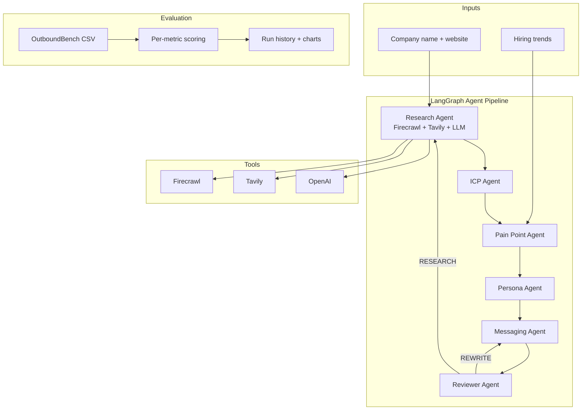

# OutboundOS

Multi-agent AI outbound SDR platform with a evidence-grounded evaluation benchmark (**OutboundBench**).

OutboundOS orchestrates six specialized agents — research, ICP scoring, pain-point analysis, persona selection, email generation, and quality review — through a **LangGraph** workflow. Agents use live web research (**Firecrawl**, **Tavily**) and structured **OpenAI** outputs in production mode.

**Benchmark results & methodology:** [`docs/BENCHMARK.md`](docs/BENCHMARK.md) · **Official scores:** [`data/benchmark_results.json`](data/benchmark_results.json) · **Full project writeup:** [`docs/PROJECT_WRITEUP.md`](docs/PROJECT_WRITEUP.md)

---

## Highlights

- **6-agent LangGraph pipeline** with reviewer loop (approve / rewrite / re-research)
- **OutboundBench** — 100-company eval dataset with evidence URLs, pain points, and reference outreach (89/100 passed automated validation)
- **Evaluation framework** — per-metric scoring, run history, cost/latency tracking, concurrency controls
- **Live agent mode** — Firecrawl scraping, Tavily search, OpenAI structured outputs
- **Production scaffold** — FastAPI, Redis/ARQ workers, SSE streaming, OpenTelemetry, Docker, CI

### Benchmark snapshot (n=100, OutboundBench — official baseline)

**Run:** `eval-20260706-045418` · Full details: [`data/benchmark_results.json`](data/benchmark_results.json)

| Metric | Score | Status |
|--------|-------|--------|
| Research accuracy | **97%** | Strong |
| Pain point accuracy | **89%** | Strong |
| ICP accuracy | **91%** | Strong |
| Email quality | **96%** | Strong |
| Reviewer agreement | **97%** | Strong |
| Persona accuracy | **27%** | Known gap — enum vs rich GT personas |

**Ops:** ~39 s / company · ~$0.009 / company · concurrency 2

---

## Architecture



### Project layout

```
app/
  agents/          # Research, ICP, pain, persona, messaging, reviewer
  dataset/         # OutboundBench build pipeline
  evaluation/      # Eval runner, metrics, OutboundBench loader
  graph/           # LangGraph workflow builder
  tools/           # Firecrawl, Tavily, LLM client, evidence collection
  api/             # FastAPI routes
data/
  outboundbench_companies.csv   # 100-company eval dataset
  benchmark_results.json        # Official published scores
docs/
  BENCHMARK.md                  # Methodology + results (source of truth)
```

---

## Quickstart

```bash
cp .env.example .env   # add OPENAI_API_KEY, FIRECRAWL_API_KEY, TAVILY_API_KEY
uv sync
uv run uvicorn app.main:app --reload
```

Health check:

```bash
curl http://localhost:8000/api/v1/health
```

Set `BENCHMARK_MODE=false` in `.env` for live agents (requires API keys).

---

## OutboundBench

Build the 100-company evidence-grounded dataset:

```bash
make outboundbench              # build from seed_companies.csv
make outboundbench-revalidate     # re-run validators on existing CSV
make outboundbench-report         # dataset quality report
```

Each record includes industry, persona, pain points, evidence URLs/snippets, and a reference outreach email. See [`docs/BENCHMARK.md`](docs/BENCHMARK.md) for field definitions and validation stats.

---

## Evaluation

```bash
# Full 100-company eval (live agents, ~45–60 min at concurrency 2)
make eval-outboundbench

# Smoke test (5 companies, ~3 min)
uv run python -m app.evaluation.run \
  --dataset data/outboundbench_companies.csv \
  --dataset-size 5 \
  --max-concurrency 2 \
  --quality-threshold 0.75

# Publish a run as the official baseline
uv run python -m app.evaluation.publish_benchmark \
  app/evaluation/history/<run-id>/summary.json
```

Artifacts: `app/evaluation/history/<run-id>/summary.json`, `records.csv`, charts.

---

## Stack

| Layer | Technology |
|-------|------------|
| API | FastAPI, Pydantic v2 |
| Orchestration | LangGraph |
| LLM | OpenAI (structured outputs) |
| Web research | Firecrawl, Tavily |
| Data | PostgreSQL, SQLAlchemy (async) |
| Cache / workers | Redis, ARQ |
| Observability | OpenTelemetry, structured JSON logging |
| Infra | Docker, GitHub Actions CI |
| Package manager | uv |

---

## Development

```bash
make check          # lint + typecheck + test
make benchmark      # multi-round benchmark harness
make run            # API server
make worker         # ARQ background worker
```

### Production features

- Redis caching and ARQ background workers
- SSE workflow streaming at `/api/v1/ops/stream`
- Evaluation job queue at `/api/v1/ops/jobs/evaluation`
- OpenTelemetry tracing with OTLP exporter
- Rate limiting (SlowAPI)
- Dockerized API, worker, PostgreSQL, Redis, OTel collector

---

## Known limitations

1. **Persona selection** — agent uses an 8-value buyer enum; ground truth uses natural-language personas. Main accuracy bottleneck (**27%** on n=100 official baseline).
2. **Cost tracking** — token/cost estimates use a word-count heuristic, not OpenAI billing APIs.
3. **Dashboard** — React UI exists but uses mock data; not wired to live API yet.

See [`docs/BENCHMARK.md`](docs/BENCHMARK.md) for honest metric framing and resume-safe claims.
