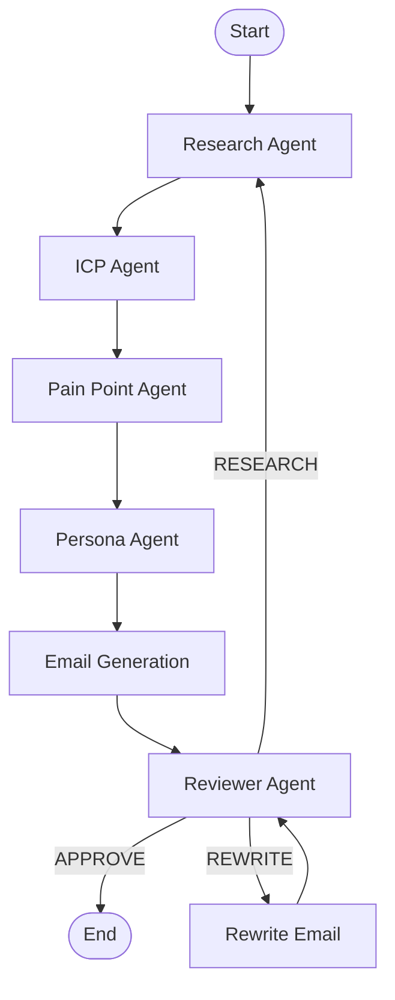

# OutboundBench & Evaluation Results

Single source of truth for OutboundOS benchmark methodology, metrics, and official scores.

**Canonical artifact:** [`data/benchmark_results.json`](../data/benchmark_results.json)

---

## OutboundBench Dataset

OutboundBench is a 100-company, evidence-grounded evaluation dataset for AI outbound SDR agents. Each record includes:

| Field | Description |
|-------|-------------|
| `company_name`, `website` | Target account |
| `industry`, `short_description` | Ground-truth company profile |
| `target_persona` | Natural-language buyer persona (not a fixed enum) |
| `pain_points` | 3–5 evidence-backed pain points |
| `evidence_urls`, `evidence_snippets` | Source URLs and excerpts used to derive labels |
| `reference_outreach` | Human-style reference cold email |
| `confidence_score`, `source_quality_score` | Pipeline confidence signals |
| `needs_human_review` | Flag for records that failed automated validation |

### Dataset quality (build-time validation)

| Stat | Value |
|------|-------|
| Companies | 100 |
| Passed automated validation | **89** |
| Needs human review | 11 |
| Avg confidence | 0.88 |
| Avg source quality | 0.97 |

### Build the dataset

```bash
# Requires OPENAI_API_KEY, FIRECRAWL_API_KEY, TAVILY_API_KEY in .env
make outboundbench

# Re-validate an existing CSV without rebuilding
make outboundbench-revalidate

# Quality report
make outboundbench-report
```

**Outputs:** `data/outboundbench_companies.csv`, `.jsonl`, `outboundbench_review_queue.csv`

---

## Agent Pipeline

OutboundOS runs a 6-agent LangGraph workflow per company:



| Agent | Input | Output |
|-------|-------|--------|
| **Research** | Company name, website | `CompanySummary` (industry, description, evidence) |
| **ICP** | Company summary | ICP fit score (0–100) |
| **Pain Point** | Summary + hiring trends | Top pain points with messaging angles |
| **Persona** | Summary + ICP | Buyer persona enum (`VP Sales`, `CTO`, etc.) |
| **Messaging** | Summary, pains, persona | Cold email + subject line |
| **Reviewer** | Full bundle | APPROVE / REWRITE / RESEARCH decision |

**Live mode** (default when `BENCHMARK_MODE=false` and API keys set): Firecrawl + Tavily web research, OpenAI structured outputs.

**Fallback mode** (`BENCHMARK_MODE=true` or missing keys): heuristic placeholders for CI and offline dev.

---

## Evaluation Metrics

All scores are in `[0, 1]` unless noted. Higher is better.

| Metric | What it measures | Notes |
|--------|------------------|-------|
| **Research accuracy** | Industry label match vs ground truth | Token overlap; exact match = 1.0 |
| **ICP accuracy** | ICP score vs target | `1 - |predicted - target| / 100` |
| **Pain point accuracy** | GT pain points covered by predictions | Per-pain token overlap threshold |
| **Persona accuracy** | Predicted buyer vs GT persona text | Role-family matching (sales, engineering, finance, etc.) |
| **Email quality** | Cold email vs GT pains + reference outreach | Weighted: company name 20%, pain overlap 40%, reference facts 25%, CTA 15% |
| **Reviewer agreement** | Reviewer decision vs expected decision | Expected derived from research + email quality |

### Honest framing

- **Strong today:** research, pain points, ICP scoring — these reflect real web-grounded intelligence quality.
- **Improving:** email quality — composite metric replaced raw string similarity in July 2026; scores are not comparable to pre-v2 runs.
- **Known gap:** persona accuracy — agent outputs a coarse 8-value enum; ground truth uses rich natural-language personas (e.g. "Designers and Design Teams"). Family matching helps but does not fully close the gap.

---

## Official Results

**Official baseline:** [`data/benchmark_results.json`](../data/benchmark_results.json)  
**Run ID:** `eval-20260706-045418` · **Generated:** 2026-07-06 · **n=100** · **Live agents**

| Metric | Score | Assessment |
|--------|-------|------------|
| Research accuracy | **97%** | Strong — industry extraction from live web evidence |
| Pain point accuracy | **89%** | Strong — evidence-backed pain identification |
| ICP accuracy | **91%** | Strong — fit scoring vs ground-truth targets |
| Email quality | **96%** | Strong — pain-grounded outreach with CTA (v2 composite metric) |
| Reviewer agreement | **97%** | Strong — reviewer decisions align with quality expectations |
| Persona accuracy | **27%** | **Gap** — coarse buyer enum vs natural-language GT personas |

| Operations | Value |
|------------|-------|
| Avg latency | 38.9 s / company |
| Avg cost | $0.0088 / company |
| Concurrency | 2 |
| Total runtime | ~33 min |

### Historical baselines (context only — do not mix metric versions)

| Run ID | n | Metrics | Research | ICP | Pain | Persona | Email | Reviewer |
|--------|---|---------|----------|-----|------|---------|-------|----------|
| `eval-20260706-045418` | 100 | **v2 (official)** | 0.97 | 0.91 | 0.89 | 0.27 | 0.96 | 0.97 |
| `eval-20260706-040559` | 100 | v1 email/reviewer | 0.98 | 0.92 | 0.92 | 0.11 | 0.06 | 0.00 |
| `eval-20260706-041432` | 5 | v2 smoke test | 1.00 | 0.94 | 0.80 | 0.20 | 0.97 | 1.00 |

Use **`eval-20260706-045418`** for resume and README citations.

---

## Run an Evaluation

```bash
# Full OutboundBench eval (100 companies, live agents)
make eval-outboundbench

# Smoke test (5 companies)
uv run python -m app.evaluation.run \
  --dataset data/outboundbench_companies.csv \
  --dataset-size 5 \
  --max-concurrency 2 \
  --quality-threshold 0.75

# Publish results as canonical baseline
uv run python -m app.evaluation.publish_benchmark \
  app/evaluation/history/<run-id>/summary.json
```

**Artifacts per run:** `app/evaluation/history/<run-id>/summary.json`, `records.csv`, charts.

---

## Resume-Safe Claims

Use these (backed by official n=100 baseline `eval-20260706-045418`):

- Built **OutboundBench** — 100-company evidence-grounded eval dataset (89/100 passed automated validation).
- Multi-agent **LangGraph** pipeline with live **Firecrawl/Tavily** research and structured **OpenAI** agents.
- **97% research accuracy**, **89% pain-point accuracy**, and **91% ICP accuracy** on OutboundBench (n=100).
- **96% email quality** and **97% reviewer agreement** with evidence-grounded outreach generation.
- Evaluated at **~$0.009/company** and **~39s latency** with cost/token tracking.

Avoid overstating:

- Persona targeting is the main bottleneck (**27%** accuracy) — cite as known gap, not a strength.
- Do not quote email/reviewer scores from pre-v2 metric runs (`eval-20260706-040559`).
